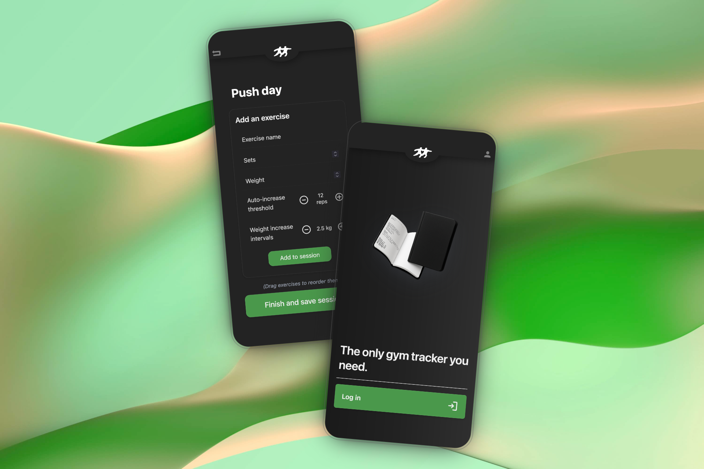

# resilnce
 *The only gym tracker you need*

  

### The goal with the project
**resilnce** aims to deliver seamless, reliable workout tracking ready to go. 
A web app that truly feels native.
No installs, no friction.
Just log in, track your progress and pick up where you left off - on any device.

### Features
* Exercise tracking with automatic weight increases once a certain rep threshold is met on an exercise. Perfect for easy progressive overload, which is key for muscle growth.
* Easy integration with your current workout plan, thanks to resilnce's quick fill feature, which can generate your plan regardless of the format you have it written down in.
* Long term statistics plotting, to follow your strength progress across exercises and sessions (🚧 _WIP_ 🚧)

### The techstack
**resilnce** is built upon the *Sveltekit* framework.
Although SvelteKit provides excellent server-side functionality,  
Go was chosen for the API layer to achieve higher throughput, lower latency, and better control over concurrency.  
It also simplifies deployment as a single, self-contained binary, making it ideal for lightweight hosting or containerization.

The Go backend is containerized using Docker before deployment, ensuring consistent builds and easy portability.

PostgreSQL is used as the main database.  
It provides reliable SQL-based data modeling, strong relational integrity, and efficient querying making it ideal for managing structured workout, user, and progress data.
This structured foundation also opens up future possibilities for advanced statistics, analytics, and performance graphs.

### How to get the full native experience
iOS users can leverage Apple's *Add to homescreen* feature to get the best experience with the web app!

  

### Project Status
🚧 **In development**  
This project is still under active development.  
Expect frequent updates, breaking changes, and experimental features as the app evolves toward a stable release.